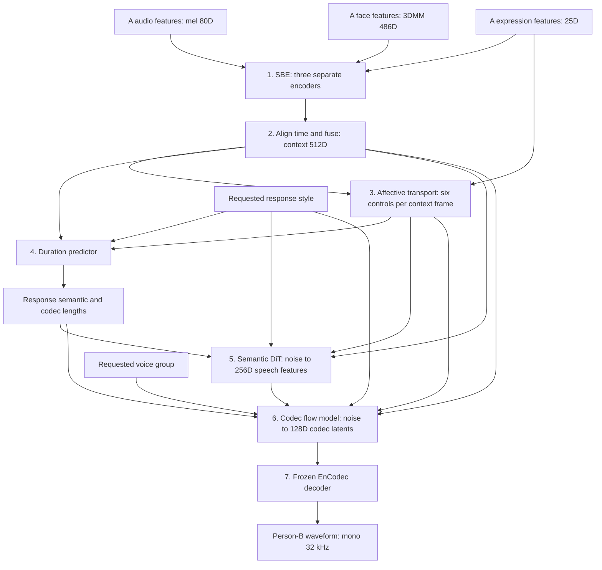
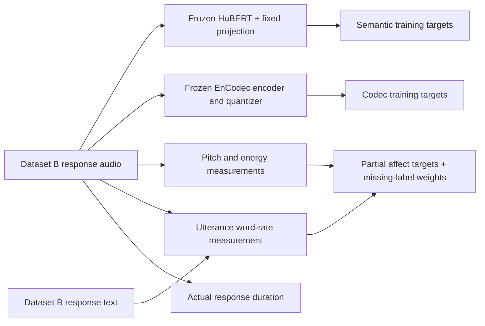

**A detailed guide to the actual code, its data, and every major input/output shape**

## Reading map

1. [What are we trying to build?](#1-what-are-we-trying-to-build)
2. [The few words you need first](#2-the-few-words-you-need-first)
3. [Read a dimension without getting confused](#3-read-a-dimension-without-getting-confused)
4. [The complete model in one picture](#4-the-complete-model-in-one-picture)
5. [The master input/output table](#5-the-master-inputoutput-table)
6. [What came from your old repository?](#6-what-came-from-your-old-repository)
7. [Module 1: reading Person A](#7-module-1-reading-person-a)
8. [Module 2: combining the three views](#8-module-2-combining-the-three-views)
9. [Module 3: planning how the response should feel](#9-module-3-planning-how-the-response-should-feel)
10. [Style and voice-group embeddings](#10-style-and-voice-group-embeddings)
11. [Module 4: choosing the response length](#11-module-4-choosing-the-response-length)
12. [Module 5: making a speech-content plan](#12-module-5-making-a-speech-content-plan)
13. [Inside the DiT building block](#13-inside-the-dit-building-block)
14. [Module 6: making the acoustic representation](#14-module-6-making-the-acoustic-representation)
15. [Module 7: turning that representation into sound](#15-module-7-turning-that-representation-into-sound)
16. [What the supplied dataset contains](#16-what-the-supplied-dataset-contains)
17. [How we turn your dataset into training examples](#17-how-we-turn-your-dataset-into-training-examples)
18. [How the affect targets are made](#18-how-the-affect-targets-are-made)
19. [What is inside one prepared file?](#19-what-is-inside-one-prepared-file)
20. [A real example from your server, end to end](#20-a-real-example-from-your-server-end-to-end)
21. [What happens during one training step?](#21-what-happens-during-one-training-step)
22. [What happens when we generate a new response?](#22-what-happens-when-we-generate-a-new-response)
23. [Different lengths, padding, masks, and alignment](#23-different-lengths-padding-masks-and-alignment)
24. [How two GPUs do the training](#24-how-two-gpus-do-the-training)
25. [How much of the model is learned?](#25-how-much-of-the-model-is-learned)
26. [A tour of the important files](#26-a-tour-of-the-important-files)
27. [Commands, checkpoints, and results](#27-commands-checkpoints-and-results)
28. [What is implemented, and what is not yet established?](#28-what-is-implemented-and-what-is-not-yet-established)
29. [Common questions](#29-common-questions)
30. [A small glossary](#30-a-small-glossary)

---

## 1. What are we trying to build?

Imagine that a friend speaks to you while you can see their face.

**Person A:** “I studied hard, but I failed my exam.”

You notice the voice, face, and expression. You choose an appropriate response, decide how long it should be, and speak in a suitable tone.

An illustrative supportive response could be:

**Person B:** “That sounds disappointing. One result does not erase the effort you put in.”

Our model is meant to learn this general input-to-response relationship from paired examples. It receives numerical descriptions of A's speech and face and produces a waveform for B's response.

The intended job has several parts:

| Question | Part of the model responsible |
|---|---|
| What information is present in A's audio and face? | Speaker Behavior Encoder, or SBE |
| How should these different types of information be combined? | Fusion MLP |
| What affective/prosodic pattern should guide the response? | Affective Response Transport |
| How long should the response be? | Response Length Predictor |
| What speech representation should the response follow? | Semantic Response Planner |
| What acoustic representation should produce that speech? | Conditional Codec Decoder |
| How do those acoustic numbers become audible sound? | Frozen neural audio codec decoder |

The new generator does **not** first write an English sentence and pass that sentence to text-to-speech. It generates continuous speech representations directly.

That is the meaning of **LLM-free in this implementation**: there is no large language model in the response-generation path. This does not tell us whether an LLM was used by whoever originally created the dataset's text; that upstream history has not been verified.

Also, “all the parts execute” and “the model produces a useful empathetic reply” are different achievements. The first can be checked with shapes, gradients, tests, and generated files. The second needs training and evaluation of the actual speech.

## 2. The few words you need first

### A feature is a useful number

A microphone gives us a long list of waveform values. A feature extractor turns that long list into a more convenient description.

Think of describing a meal by its temperature, sweetness, saltiness, and texture. Those descriptions are not the meal itself, but they provide useful information about it.

For this model, a mel frame has 80 numbers. A face frame has 486 3DMM numbers. An expression frame has 25 numbers.

### A frame is one small time step

A video is many pictures in order. Audio features also come in small time steps, called frames.

Different parts use different frame rates. A “frame” in the mel representation is not the same length of time as a “frame” in the codec representation.

### A tensor is an organized box of numbers

A single number is a scalar. A list of numbers is a vector. A table of numbers is a matrix. A tensor is the general name for these and higher-dimensional arrangements.

You can picture a three-dimensional tensor as a stack of tables: one table for each example.

### A neural network learns a numerical rule

The rule is controlled by many adjustable numbers called **parameters** or **weights**.

At initialization, the new generator does not know how to respond. During training, it makes predictions, measures its mistakes, and adjusts those weights.

### An embedding is a learned numerical representation

An embedding is like a reusable numerical description. Its coordinates usually do not have simple individual names.

For example, coordinate 17 of a 512-dimensional context vector is not guaranteed to mean “sadness.” Meaning is distributed across many coordinates.

### A latent is an internal representation

A latent is a hidden representation used between the input and output. It is not normally something a person can read or listen to directly.

The codec latent is like a compact set of instructions understood by the audio decoder.

### A target is the answer used during training

If A says something and the dataset supplies B's response audio, that B audio can provide training targets. Those targets are available while learning, but they are not given to the model when it must produce a new answer.

### Frozen means “do not update its weights”

A pretrained model has already learned useful representations elsewhere. A frozen pretrained model is used as a fixed tool.

In our system, HuBERT and EnCodec are frozen. The new response generator learns to work with the representations they provide.

## 3. Read a dimension without getting confused

Suppose you see:

```text
[B, T, D]
```

Read it as:

```text
[how many examples, how many time steps, how many numbers at each time step]
```

For example:

```text
[4, 100, 512]
```

means four examples, each stored with 100 time slots, each slot containing 512 numbers. Shorter examples may have unused padded slots, discussed later.

**Do not confuse `B` for batch size with “Person B.”** They happen to use the same letter in many machine-learning diagrams. In this guide, square-bracket shapes use `B` for batch size. “Person B” always means the responding person.

| Symbol | Meaning |
|---|---|
| `B` | Number of examples in this batch on one GPU |
| `T_m` | Number of Person-A mel frames |
| `T_v` | Number of Person-A 3DMM frames |
| `T_e` | Number of Person-A expression frames |
| `T_c` | Number of aligned context frames |
| `T_a` | Number of target affect frames derived from the response audio |
| `d_B` | Person-B response duration in seconds |
| `N_B` | Number of response semantic tokens/frames |
| `T_B` | Number of response codec frames; corresponds to `T_B*` in the diagram |
| `L_B` | Number of response waveform samples |
| `c` | Fused context describing Person A |
| `a_B*` | Predicted response affect/prosody trajectory |
| `z_B` | Response semantic representation |

The following are different kinds of numbers:

| Number | What it measures | What it does **not** measure |
|---|---|---|
| `80` mel dimensions | Numbers describing one audio feature frame | Seconds or words |
| `512` context dimensions | Numbers describing one context frame | 512 emotions |
| `25 Hz` context rate | Approximately 25 context frames per second | 25 waveform samples per second |
| `12.5 Hz` semantic rate | 12.5 semantic slots per second | 12.5 words per second |
| `50 Hz` codec rate | 50 codec frames per second | 50 Hz voice pitch |
| `32,000 Hz` waveform rate | 32,000 audio samples per second | 32,000 semantic tokens per second |

### A simple numerical example

For an illustrative **6.4-second response**:

```text
Semantic slots = ceil(6.4 × 12.5) = 80
Codec frames   = ceil(6.4 × 50)   = 320
Audio samples  = round(6.4 × 32,000) = 204,800
```

For one example, the response representations have shapes:

```text
semantic: [1, 80, 256]
codec:    [1, 320, 128]
waveform: [1, 204800]
```

`ceil` rounds upward so a partial final frame is retained. The implementation first converts duration to an integer number of audio samples before counting frames. This avoids floating-point errors accidentally adding an extra frame at an exact boundary.

## 4. The complete model in one picture



This is the **generation path**. During training there is an additional preparation path:



The second picture supplies answers for learning. At generation time, the model must make its own semantic plan, affect trajectory, duration, and codec representation.

## 5. The master input/output table

These are the full model's configured dimensions for the server run. Time lengths vary from example to example.

| Stage | Main inputs | Main output | Plain explanation |
|---|---|---|---|
| Audio branch | `mel [B,T_m,80]` | `[B,T_m,512]` | Convert A's sound features into a shared feature width |
| Appearance branch | `dmm [B,T_v,486]` | `[B,T_v,512]` | Encode A's face sequence |
| Expression branch | `au [B,T_e,25]` | `[B,T_e,512]` | Encode A's expression changes over time |
| Temporal alignment | Three sequences with different lengths | Three `[B,T_c,512]` sequences | Put the descriptions on a common timeline |
| Concatenation | Three aligned 512D vectors | `[B,T_c,1536]` | Put their numbers side by side |
| Fusion MLP | `[B,T_c,1536]` | `context [B,T_c,512]` | Learn a combined description |
| Affective transport | Context `[B,T_c,512]`, original A expression `[B,T_e,25]` | `affect [B,T_c,6]` | Predict a response-control trajectory |
| Style lookup | Integer `style_id [B]` | `[B,256]` | Look up the requested response style |
| Voice-group lookup | Integer `speaker_id [B]` | `[B,256]` | Look up the requested audio group |
| Duration pooling | Context and affect sequences | `[B,512]` and `[B,6]` | Summarize valid frames |
| Duration MLP | Concatenated `[B,774]` | Log-duration `[B]`, duration `[B]` | Predict one positive response length per example |
| Length calculation | Duration `[B]` | Semantic counts `[B]`, codec counts `[B]` | Allocate the response's time slots |
| Semantic DiT | Noisy `[B,N_B,256]`, affect aligned to `[B,N_B,6]`, context, style | Noise estimate `[B,N_B,256]` | Learn how to clean a noisy semantic representation |
| Semantic sampling | Gaussian noise and A-derived conditions | Semantic representation `[B,N_B,256]` | Produce all response-content slots through repeated refinement |
| Codec local conditioning | Semantics resized to `[B,T_B,256]`, affect resized to `[B,T_B,6]` | `[B,T_B,262]` | Combine content and prosody for each codec frame |
| Codec flow DiT | Noisy `[B,T_B,128]`, local conditions, context, style + voice group | Velocity `[B,T_B,128]` | Predict how acoustic latents should change |
| Codec sampling | Gaussian noise and conditions | Codec latents `[B,T_B,128]` | Integrate those changes into a response representation |
| Frozen codec decoder | Per-example valid codec latents `[1,128,T_B]` internally | Waveform, collected as `[B,L_max]` | Turn the latents into sound, then pad only for batching |
| Saved WAV | One valid waveform prefix | Mono audio at 32,000 samples/second | The file you can listen to |

For a variable-length batch, `T_c`, `N_B`, `T_B`, and `L_max` in the stored tensor shape are the maximum widths in that batch. Separate lengths and masks tell us how much belongs to each individual example.

### The active configuration versus other presets

| Setting | Current server configuration | General full-model preset |
|---|---:|---:|
| Mel width | 80 | 80 |
| 3DMM width | 486 | 486 |
| Expression width | 25 | 25 |
| Context width | 512 | 512 |
| Affect width | 6 | 6 |
| Main DiT hidden width | 256 | 256 |
| Semantic width | 256 | 256 |
| Codec width | 128 | 128 |
| Number of style entries | 6 | 6 |
| Number of speaker/group entries | 2 | 32 |
| Minimum predicted duration | 0.2 seconds | 0.2 seconds |
| Maximum predicted duration | 120 seconds | 20 seconds |
| Semantic sampling steps | 24 | 24 |
| Codec integration steps | 32 | 32 |

The server's 120-second maximum is a configured safety bound for deferred audio validation. It is **not** a measured maximum dataset duration, and it does not mean responses are padded to 120 seconds. Batches are padded only to their actual longest member.

`configs/full_speech_small.json` is a smaller development preset. `configs/full_speech_diagram_inputs.json` explicitly supports the diagram's 58D face input and 100 Hz mel input. Those are different input contracts; we do not reshape your 486D features into 58D features.

## 6. What came from your old repository?

We kept the existing SBE and its original feature dimensions as the starting point. We connected new response-planning and speech-generation modules around it.

| Component | Origin or change | Why it matters |
|---|---|---|
| Mel audio encoder | Existing repository | Preserves how the baseline consumes 80D mel features |
| Appearance encoder | Existing repository | Preserves the 486D face input and temporal Transformer |
| Expression encoder | Existing repository | Preserves the recurrent expression encoder |
| Fusion MLP | Existing repository | Preserves the three-branch combination into 512D context |
| Affective Response Transport | New | Gives downstream generation an explicit six-channel control sequence |
| Duration predictor | New | Learns the response length instead of requiring the answer length at inference |
| Semantic DiT planner | New | Generates a response speech representation without a text-generating LLM |
| Codec flow decoder | New | Generates neural codec latents instead of the old mel-output route |
| EnCodec adapter | New integration of pretrained weights | Provides a real fixed audio decoder and compatible training targets |
| HuBERT teacher adapter | New integration of pretrained weights | Provides fixed response speech-feature targets |
| Paired target preparation and cache | New | Connects the actual dataset to the new losses |
| Full trainer, DDP, resume, inference | New | Makes the new path executable and trainable |

The old entry points still exist. For this architecture, use `prepare_full.py`, `train_full.py`, and `infer_full.py`, rather than assuming an older `train.py` or `infer.py` runs the same model.

Some old SBE comments describe pooled `[B,512]` outputs. The executing full-model path returns a sequence, **`[B,T_c,512]`**. This guide follows the actual operations and tests rather than those stale descriptions.

## 7. Module 1: reading Person A

Think of three helpers observing the same person. One listens, one follows the face representation, and one follows expression changes. Each helper translates its observations into vectors of the same width: 512.

### 7.1 The audio helper

The audio input is a **mel-spectrogram**. You can picture it as a compact description of how sound energy is distributed across frequency bands over time.

The code does:

```text
[B,T_m,80]
  → Linear(80 → 512)
  → LayerNorm(512)
  → [B,T_m,512]
```

A linear layer learns how to mix the 80 input numbers into 512 output numbers. It does not create 512 separate recordings.

Layer normalization helps keep each feature vector's scale manageable. This is different from changing the volume of a WAV file.

**Example:** A quiet voice and a forceful voice may have different mel patterns. The audio branch can learn which patterns are useful for predicting the paired responses. There is no hard-coded rule saying “quiet means sad.”

The configured input mel rate is:

```text
22,050 / 256 = 86.1328125 frames per second
```

This preserves the baseline's feature contract. The model reads precomputed mel files; it does not recalculate them from A's WAV in the new inference command.

### 7.2 The appearance helper

`3DMM` means a three-dimensional morphable face representation. Instead of processing every RGB pixel here, the model reads numerical face coefficients that were already extracted.

Each frame in this dataset has **486 coefficients**. We preserve those numbers as a vector without inventing names for every coordinate.

The main path is:

```text
[B,T_v,486]
  → Linear(486 → 512)
  → positional information
  → four Transformer encoder layers
  → [B,T_v,512]
```

The existing appearance Transformer uses four attention heads and an internal feed-forward width of 1024.

**Example:** A face sequence can change during a sentence. Looking at several frames together can be more useful than treating each frame as an unrelated photograph.

The baseline also contains a projection head used by other purposes. The full speech path consumes the main frame features, not that extra projected output.

### 7.3 The expression helper

The `au` input has 25 features per frame. `AU` commonly refers to facial action units, but the dataset's complete column definitions were not supplied. We do **not** claim every column is a particular named muscle movement, or silently assume that a particular column is valence.

The active branch uses the recurrent encoder and frame projection already present in the supplied integrated SBE:

```text
[B,T_e,25]
  → existing GRU-based recurrent encoder, hidden width 512
  → Linear(512 → 512) for each frame
  → [B,T_e,512]
```

A recurrent unit carries a small numerical memory forward through the sequence.

**Example:** “The expression changed from tense to relaxed” requires seeing a sequence, rather than just one frame. The recurrent branch can represent such changes.

Although its enclosing legacy class is named `AutoencoderRNN_VAE_v2`, the current SBE uses its recurrent feature path. It does not sample a VAE latent or use that class's old face-reconstruction decoder in this speech forward pass.

### 7.4 Are these branches frozen?

In the architecture drawing, some branches are marked pretrained/frozen. In the current server run, no compatible trained SBE checkpoint was provided. Therefore the active SBE branches learn from scratch.

Freezing a randomly initialized face encoder would preserve random features. We deliberately did not present that as a pretrained frozen encoder.

The trainer also supports a compatible complete SBE checkpoint. In that alternative mode it freezes the visual and expression branches while the remaining relevant parts learn.

## 8. Module 2: combining the three views

### 8.1 Why alignment is necessary

The audio helper may produce hundreds of mel frames while the face helpers produce fewer video frames. We cannot simply put frame 100 from each beside one another and assume they represent the same relative time.

For each example, the SBE calculates:

```text
audio duration estimate      = mel length / 86.1328125
appearance duration estimate = 3DMM length / 25
expression duration estimate = expression length / 25

shared duration = minimum of these three estimates
T_c = max(1, floor(shared duration × 25))
```

Then it linearly resizes each valid feature sequence to `T_c` frames.

**Important detail:** the implementation resizes each entire valid sequence to the common length. This is relative-time interpolation, not timestamp-based synchronization or a word-alignment system. Correctly synchronized source features are still important. If one modality covers a different event or has an offset, interpolation does not magically repair that problem.

### 8.2 What concatenation means

At one aligned time step, we have:

```text
audio:      512 numbers
appearance: 512 numbers
expression: 512 numbers
```

Concatenation places them side by side:

```text
512 + 512 + 512 = 1536 numbers
```

The fusion network is:

```text
[B,T_c,1536]
  → Linear(1536 → 512)
  → ReLU
  → Linear(512 → 512)
  → context c: [B,T_c,512]
```

`MLP` means multilayer perceptron: a small stack of learned numerical transformations.

**Example:** A smiling face with an excited voice is a different combination from a smiling face with a strained voice. Fusion can learn useful combinations. It is not a hand-written emotion lookup table.

We keep the sequence of context vectors. Averaging everything immediately would throw away the ordering of events in A's clip.

## 9. Module 3: planning how the response should feel

This is the **Affective Response Transport** module you first requested.

Its job is to turn information about A into a control trajectory for B's response. “Transport” here means a learned transformation between representations. It is not network transport, and it is not an implemented mathematical optimal-transport solver.

### 9.1 Input and output

| Item | Shape | Meaning |
|---|---|---|
| Fused context | `[B,T_c,512]` | Combined evidence about A |
| Original expression sequence | `[B,T_e,25]` | A's expression features, supplied again explicitly |
| Context mask | `[B,T_c]` | Which time slots are real |
| Predicted affect trajectory | `[B,T_c,6]` | Six response-control values per context frame |
| Mean-pooled affect summary | `[B,6]` | Average controls over valid frames |

The expression input appears twice in the overall architecture: once through SBE/fusion and once directly into affective transport. The direct path makes expression evidence explicitly available to this module.

### 9.2 How we constructed it

The actual operations are:

```text
context 512D → LayerNorm → Linear → 128D
expression 25D → align to T_c → LayerNorm → Linear → 128D

add the two 128D representations
  → LayerNorm
  → add sinusoidal position information
  → two temporal Transformer layers
  → Linear(128 → 6)
  → output range restrictions
```

Each temporal Transformer layer uses four attention heads, a feed-forward width of 256, and dropout 0.1.

Why add positions? Without information about order, a collection of frames is less able to represent “first tense, then relaxed.” Position encodings give the network a way to distinguish earlier and later frames.

Why attention over time? A brief expression may mean something different depending on what happened before and after it.

This module is **bidirectional and offline**: it can use the whole available input clip. It is not an incremental live-streaming response engine.

### 9.3 The six channels

| Index | Name | Intuitive meaning | Output range | Direct target in this server run? |
|---|---|---|---|---|
| 0 | Valence | Positive/negative emotional direction | `[-1,1]` | No documented label |
| 1 | Arousal | Calm/activated emotional intensity | `[0,1]` | No documented label |
| 2 | Pitch | Normalized voice-pitch control | `[0,1]` | Yes, on estimated voiced frames |
| 3 | Energy | Normalized sound-energy control | `[0,1]` | Yes, measured from response audio |
| 4 | Speaking rate | Normalized utterance word-rate proxy | `[0,1]` | Yes, from reference text and duration |
| 5 | Dominance | Intended assertiveness/control dimension | `[0,1]` | No documented label |

The code uses `tanh` for valence and `sigmoid` for the other five coordinates. These functions keep outputs in their configured ranges. They do not prove that the coordinates have learned their intended human meaning.

### 9.4 Why A's emotion should not simply be copied

Suppose A sounds anxious. A useful B response might sound steady and reassuring. Copying A's anxiety would not necessarily be empathetic.

The transport network can learn a different trajectory because its training objectives come from the paired responses. There is no fixed code rule such as “anxious A always produces calm B.”

### 9.5 Two current limitations you should understand

First, only pitch, energy, and the speaking-rate proxy have direct labels in this run. The other channels receive indirect gradient signals because later modules use them. However, a number in the valence coordinate cannot yet be treated as a validated valence measurement.

Second, this transport module receives A's context and expression, **not the style ID**. For a fixed A input, its evaluation-time output is therefore the same across requested styles. Style affects the duration predictor, semantic planner, and codec generator downstream. Multiple response styles can consequently provide different direct affect targets for the same A-conditioned trajectory; the learned result may be a compromise. Style-dependent affect planning would require an additional architectural change.

### 9.6 Why the trajectory initially follows A's timeline

A may speak for 12 seconds while B responds for 8 seconds. Transport initially produces controls on the context timeline, for example `[1,300,6]` for 12 seconds at 25 Hz.

The later modules resize this control sequence to the semantic or codec timeline. We preserve the relative progression of the controls; we do not assume that A and B have identical durations or word boundaries.

## 10. Style and voice-group embeddings

An embedding table works like a numbered drawer cabinet. Give it an integer ID and it returns a vector of learned numbers.

### Style IDs

| ID | Style | Illustrative response to “I failed my exam” |
|---|---|---|
| 0 | Affective Listening | “That sounds really disappointing.” |
| 1 | Cognitive Empathy | “It makes sense to feel upset after working so hard.” |
| 2 | Humor/Lighthearted | “That exam certainly did not give you a friendly welcome.” |
| 3 | Practical Advice | “We could review which topics were hardest and plan the next attempt.” |
| 4 | Reflective/Mirroring | “You put in a lot of effort, and the result hurt.” |
| 5 | Supportive/Encouraging | “This result does not erase your progress.” |

These are explanatory examples, not automatically generated outputs or guaranteed appropriate responses in every situation.

The table has shape `[6,256]`. A batch of style IDs `[B]` becomes style vectors `[B,256]`.

The style is a requested input. The current inference code does not automatically decide which of the six styles is best for the situation.

### Voice groups

The server's table has shape `[2,256]`:

| ID | Available dataset label | Interpretation |
|---|---|---|
| 0 | `female` | Metadata audio group |
| 1 | `male` | Metadata audio group |

These are **not verified individual voice identities**. We do not know whether all recordings in a group use one fixed voice or several voices. A reference face picture also does not prove which voice produced the audio.

The model's interface is called `speaker_id` because it can support verified speaker identities in a better-annotated dataset. In this run, those IDs represent only the two available groups.

For codec generation, the model adds the 256D style embedding and 256D voice-group embedding. The result is still 256D. The semantic planner uses the style embedding without the voice-group embedding.

## 11. Module 4: choosing the response length

A response cannot be generated into a fixed number of slots unless we know how many slots to allocate.

An illustrative short acknowledgment might need two seconds. A practical explanation might need eight seconds. The duration predictor learns from the durations of the actual paired responses.

### 11.1 Build a summary

The model averages the **valid** context frames and valid affect frames:

```text
context [B,T_c,512] → [B,512]
affect  [B,T_c,6]   → [B,6]
style               → [B,256]
```

Then it concatenates those summaries:

```text
512 + 6 + 256 = 774
```

The MLP does:

```text
[B,774] → Linear(774 → 256) → SiLU → Linear(256 → 1)
```

The result is one log-duration per example. Exponentiating a log-duration makes the corresponding duration positive. For allocation at inference, it is bounded by the configured duration limits.

### 11.2 Seconds become counts

Conceptually:

```text
N_B = ceil(predicted seconds × 12.5)
T_B = ceil(predicted seconds × 50)
L_B = round(predicted seconds × 32,000)
```

The implementation uses the integer audio-sample count as the common reference when calculating frame counts, so boundary rounding stays consistent.

The prediction is learned from A and style. B's true duration is not an inference input.

During training, however, the semantic and codec tensors use **ground-truth target lengths**. We compare predicted log-duration with actual log-duration separately. This lets the generators learn from complete target tensors while the duration predictor learns its own task.

There is no gradient through a rounded integer length allocation at inference. The explicit duration loss is what teaches the length head to predict suitable durations.

## 12. Module 5: making a speech-content plan

The Semantic Response Planner produces a sequence of 256-dimensional continuous vectors at 12.5 slots per second.

### 12.1 What “semantic token” means here

In some systems, a token is an integer representing a word or a vocabulary entry. Here it is a **continuous 256D speech-feature vector**.

It is not an English word, not a text token ID, and not a guarantee of a specific sentence. The vectors come from a frozen speech representation model during preparation, and the planner learns to generate vectors in that representation space.

“Semantic” describes their intended role in carrying speech content. HuBERT-derived features can still contain phonetic, acoustic, and other information; they are not a perfectly separated representation of abstract meaning.

### 12.2 Where the correct targets come from

For each dataset B response:

```text
B response waveform
  → mono audio at 16 kHz
  → per-utterance waveform normalization
  → frozen HuBERT hidden representations: 768D
  → fixed 768D-to-256D orthogonal projection
  → temporal interpolation to 12.5 Hz
  → [N_B,256] target
```

The projection is initialized deterministically using seed 42 and is not learned. An orthogonal projection uses a set of perpendicular numerical directions for the reduction. Reducing 768 dimensions to 256 can discard information; it is a chosen engineering simplification, not a separately trained semantic tokenizer.

HuBERT is used to make B targets. It is **not** the Person-A encoder in the current generator. A's audio enters through the original mel branch.

### 12.3 How diffusion teaches the planner

Imagine a useful numerical pattern being gradually covered by static. We train a helper to identify the static while looking at A's context, the affect controls, and the requested style.

At each training step:

1. Start with the correct normalized semantic target.
2. Choose a random noise level.
3. Mix the target with Gaussian noise.
4. Give that noisy representation and the conditions to the DiT.
5. Ask the DiT to predict the noise that was added.
6. Penalize the difference between the predicted and actual noise.

The compact equation is:

```text
noisy_semantics = alpha(t) × clean_semantics + sigma(t) × noise
```

You can read `alpha` and `sigma` as two volume knobs: one controls how much clean signal remains, and one controls how much noise is added. The code uses a cosine-based schedule to set those knobs.

### 12.4 How it generates without seeing the answer

At inference, there is no clean target to start with. The planner starts from noise of shape `[B,N_B,256]` and refines it over 24 steps by default.

The sampler estimates a cleaner representation and moves to the next noise level using a DDIM-style update. Estimated clean values are clamped to `[-5,5]` in normalized target space during sampling.

All time positions are processed together at each refinement step. That is **non-autoregressive** generation. It does not mean “one pass”: the model still performs repeated refinement.

**Example:** For a requested supportive response to the exam story, the planner should learn representations associated with supportive paired speech. The code does not contain a sentence template saying exactly what to say.

## 13. Inside the DiT building block

`DiT` means diffusion Transformer in this design. We reuse a conditional Transformer structure for both the semantic noise predictor and the codec velocity predictor.

Picture a group writing a response together:

- **Self-attention:** each response time slot checks other response slots.
- **Cross-attention:** each response slot checks the encoded evidence about A.
- **Feed-forward network:** each slot transforms and refines its current representation.

### 13.1 Before the blocks

| Information | Transformation | Result |
|---|---|---|
| Noisy semantic vector | `256 → 256` | Semantic hidden vector |
| Noisy codec vector | `128 → 256` | Codec hidden vector |
| Local affect for semantic planner | `6 → 256` | Local condition |
| Local semantics + affect for codec model | `262 → 256` | Local condition |
| A's context | `512 → 256` | Cross-attention memory |
| Diffusion/flow time | Sinusoidal encoding and MLP | `[B,256]` timing condition |
| Valid response length | `log(length)` then `1 → 256` | `[B,256]` length condition |
| Response position | Sinusoidal position encoding | Position-specific 256D vector |

The response hidden state combines projected noisy input, local condition, and position information.

The global condition combines style, optionally voice group, noise/flow time, and response length.

### 13.2 Inside each block

The block has three operations: self-attention, cross-attention, and an MLP. Each receives normalization and condition-dependent adjustments.

The condition creates **shift, scale, and gate** values:

| Adjustment | Simple explanation |
|---|---|
| Shift | Move the feature values up or down |
| Scale | Strengthen or weaken their variation |
| Gate | Control how much of an update is added |

This is conditional/adaptive normalization. The same block can behave differently for different response styles or noise levels.

Both new DiT networks use hidden width 256 and four attention heads. Their feed-forward layers expand `256 → 1024 → 256`.

The semantic planner has four blocks. The codec generator has six blocks.

Attention heads are parallel learned ways to compare information. We do not assign a guaranteed human role such as “head 1 understands sadness.”

## 14. Module 6: making the acoustic representation

The semantic representation is still not a playable audio file. We need a representation that the neural audio decoder understands.

The Conditional Codec Decoder generates 128-dimensional codec latents at 50 frames per second.

### 14.1 Gather all conditions

For every target codec frame, resize:

```text
semantic representation → 256 numbers
affect trajectory       →   6 numbers
combined local input   → 262 numbers
```

The model also receives A's context through cross-attention and style plus voice-group information through the global condition.

The conditions have distinct jobs:

| Condition | Intended contribution |
|---|---|
| Semantic representation | Response speech content |
| Affect trajectory | Prosodic/affective guidance |
| A context | Information from the original speaker |
| Style embedding | Requested response approach |
| Voice-group embedding | Available audio-group condition |
| Time and length | Where the refinement is and how long the response is |

These roles are intentions, not proof that the learned factors become perfectly separated.

### 14.2 What flow matching means

Imagine starting at a random location and learning the direction toward a useful destination.

Here the random location is a Gaussian-noise tensor. The destination during training is the correct normalized codec latent tensor.

We choose a random point between the two:

```text
mixed = (1 - t) × noise + t × target
correct_velocity = target - noise
```

At `t = 0`, the mixture is noise. At `t = 1`, it is the target. The network sees the mixture, time, and conditions and learns to predict the velocity needed to move toward the target.

This training objective is called rectified flow matching in the implementation.

### 14.3 How it creates latents at inference

We start with fresh noise `[B,T_B,128]`. The flow model repeatedly predicts how to move the tensor.

The sampler uses **midpoint integration**: it estimates a direction, looks halfway along that proposed step, then uses a second estimate to make the update.

There are 32 integration steps by default and two velocity evaluations per step, so the codec sampler uses 64 DiT evaluations. This is separate from the 24 semantic refinement evaluations.

At the end, the code undoes target normalization and passes the codec latents to the fixed audio decoder.

### 14.4 What “codec targets” really are

EnCodec first encodes the dataset waveform and quantizes its representation using its codebooks. The adapter decodes those codebook choices into the **summed quantized 128D embeddings consumed by the neural decoder**.

Those embeddings are our cached training targets. We do not train a new codec vocabulary here.

The flow model generates continuous latent vectors. They are passed directly to the neural decoder; they are not required to be exact discrete codebook combinations at inference. Therefore a pretrained decoder alone does not guarantee good output if generated latents are poor.

### 14.5 Training and inference use different semantic sources

During training, the codec generator is conditioned on **ground-truth semantic features extracted from B's audio**. This is teacher forcing for the semantic condition.

During inference, it receives **the semantic planner's generated features**.

If generated semantics are less accurate than the training targets, the codec generator may perform worse during full generation. This difference is a current training-design limitation, not something hidden by the architecture diagram.

## 15. Module 7: turning that representation into sound

The final stage uses the pretrained `facebook/encodec_32khz` decoder.

Its relevant contract is:

| Property | Value |
|---|---:|
| Sample rate | 32,000 samples/second |
| Codec frame rate | 50 frames/second |
| Latent width | 128 |
| Samples per codec frame | `32,000 / 50 = 640` |
| Channels in the exported response | Mono |

The pipeline stores latents as `[B,T_B,128]`. The decoder's internal input layout is `[B,128,T_B]`, so the adapter transposes the last two dimensions.

Each example is decoded separately using only its valid frames. That prevents a short example's padded tail from being interpreted as real codec input.

If the decoder produces enough samples for a partial final frame, the waveform is trimmed to `round(predicted_duration × 32000)`.

### Why the decoder is frozen

We want a stable relationship between codec latents and audio. If we changed that decoder while also teaching the generator to produce its latents, the target representation would no longer be as stable.

The generator learns; the decoder stays fixed.

The audio-writing code saves a PCM-16 WAV. If the raw waveform peak exceeds 0.95, it attenuates the whole waveform enough to avoid clipping. It does not boost quiet audio. The unmodified generated waveform is also retained in `stages.npz`.

A saved WAV file can contain noise or unintelligible sound. “Audio was written successfully” is an execution result, not a speech-quality verdict.

## 16. What the supplied dataset contains

Your dataset is located at:

```text
/home/aisha/bk-dataset/
```

It already contains generated audio/video, extracted features, reference face images, and conversation metadata.

### 16.1 What we know about how it was made

From the inspected files, we can establish this structure:

```text
one Person-A conversation item
  + input text, gender label, emotion label, reference face
  + six styled Person-B response entries
  + associated generated audio/video
  + associated extracted feature files
```

We did **not** recreate the original speech/video corpus from scratch. The supplied data does not establish which exact text generator, TTS voices, face-animation system, feature-extractor versions, or random seeds originally produced every file. Naming an unverified upstream tool would be a guess.

What we constructed is the reliable pairing, split, target-extraction, cache, and training path for this existing corpus.

### 16.2 Dataset folders and their roles

| Folder | Contents | Used by the new full-model path? |
|---|---|---|
| `generated_text` | Conversation JSON and six response styles | Yes: pair matching, splits, style/voice labels, reference word counts |
| `generated_input_audio` | A's source waveform files | Not directly read by the new generator; its cached mel features are used |
| `generated_input_audio_mel_official` | A's mel features | Yes |
| `generated_input_video_3dmm` | A's per-frame face coefficients | Yes |
| `generated_input_video_AU` | A's 25D expression features | Yes |
| `generated_output_audio` | B's reference response waveform | Yes, during target preparation |
| `generated_output_audio_mel_official` | B's existing mel features | Not the target for the new codec path |
| `generated_input_audio_mfcc` / output counterpart | Existing MFCC features | Not used by this full speech training path |
| `generated_input_audio_wav2vec` / output counterpart | Existing audio representations | Not used as the new HuBERT targets |
| `generated_input_video_exp` / output counterpart | Additional expression representations | Not interpreted as direct affect labels without a documented column contract |
| `generated_output_video_AU` | B's expression features | Not used as direct six-channel affect supervision in this run |
| `generated_output_video_3dmm` | B's face coefficients | Not used to train this audio-output path |
| Input/output video folders and frame folders | Rendered videos and extracted images | Not directly consumed by the new model entry points |
| `reference_face_img` | Reference face images | Metadata helps match feature filenames; not treated as verified voice identity |

Keeping a folder in the dataset does not mean every model uses that folder. The new audio generation route needs a specific subset.

### 16.3 One conversation becomes six paired examples

Suppose one A clip says:

> “I remember going to see the fireworks with my best friend.”

The metadata contains responses for Affective Listening, Cognitive Empathy, Humor/Lighthearted, Practical Advice, Reflective/Mirroring, and Supportive/Encouraging.

The same A features are reused for six pairs. The B response audio and style differ.

```text
10,000 conversations × 6 response styles = 60,000 paired examples
```

They are not 60,000 independent A conversations.

### 16.4 Why the split is by conversation

Imagine putting A's supportive response pair in training and the same A clip's practical-advice pair in testing. The model has already encountered exactly that input in training. The test would be less independent.

We split conversation IDs first, then expand their responses:

| Split | Conversations | Response pairs | Purpose |
|---|---:|---:|---|
| Training | 8,500 | 51,000 | Update model weights |
| Validation | 1,000 | 6,000 | Measure held-out training objectives and select checkpoints |
| Test | 500 | 3,000 | Reserve inputs for later assessment and the final example |
| Total | 10,000 | 60,000 | Full supplied pairing |

The split uses a fixed seed of 42. The code also validates that no conversation ID crosses split boundaries.

This prevents leakage by `conv_id`. It does not independently prove that two different IDs never contain duplicate or closely paraphrased content; that would require an additional content-duplication audit.

## 17. How we turn your dataset into training examples

There are two main preparation steps.

### Step A: build a source manifest

`scripts/build_bk_source.py` reads:

```text
generated_text/train_final_with_reference_images.json
```

For each response, it connects:

```text
A mel file
A 3DMM directory
A expression file
B response WAV
B reference text
style ID
voice-group ID
conversation ID
train/validation/test assignment
```

The manifest is a list of those relationships. It is like a class register telling the trainer which input belongs to which answer.

The script uses the baseline's filename conventions. For example, a conversation ID `hit:0_conv:1` becomes the prefix `hit_0_conv_1`.

The inspected dataset also uses `surprise` in some actual feature filenames while reference-image metadata says `surprised`. We added an explicit fallback for that observed alias. We did not substitute unrelated examples or create dummy feature files.

The full source audit matched all 60,000 response paths. Audio-content validation happens when the waveforms are actually loaded for target preparation, avoiding an unnecessary second pass through the large collection of files.

### Step B: prepare targets

`prepare_full.py` reads each paired record and:

1. Loads A's mel, 3DMM, and expression features.
2. Reads B's waveform and averages channels if necessary to get mono audio.
3. Checks the waveform is finite and its duration is inside the configured bounds.
4. Resamples B's waveform to 32 kHz for EnCodec.
5. Extracts quantized codec embedding targets.
6. Resamples the signal to 16 kHz for HuBERT.
7. Extracts and projects semantic targets.
8. Computes the available affect/prosody targets and their supervision weights.
9. Saves one compressed `.npz` file containing the paired numerical arrays.
10. Validates the finished cache using the same data contract used by training.

The supplied 3DMM files are stored per frame, commonly as `[1,486]`. They are sorted by filename and stacked into `[T_v,486]`.

### Why cache the targets?

Running HuBERT and EnCodec on the entire corpus every epoch would repeat expensive work. We compute those fixed targets once and reuse them.

Think of preparing a workbook before class: once the questions and answer sheets are organized, the student can practice without asking the teacher to rewrite every sheet each time.

### What the cache records to prevent mix-ups

The target contract records dimensions, rates, model names, model revisions, and projection seed. Preparation also hashes the source and configuration for resume checking.

| Frozen model | Pinned revision |
|---|---|
| `facebook/encodec_32khz` | `d0c45384f6c44db055f78200cfdcb9c1c8706727` |
| `facebook/hubert-base-ls960` | `dba3bb02fda4248b6e082697eee756de8fe8aa8a` |

This keeps two caches made with incompatible teachers from being silently treated as the same dataset.

Samples are written to temporary files and renamed only after writing finishes. With `--resume`, completed samples from the same source/configuration can be reused. A completion marker is written after validation succeeds.

Both GPUs prepare targets, with a conversation assigned to one GPU so its A features can be reused across its six responses. These frozen-teacher computations are **preparation**, not optimizer updates to the new generator.

## 18. How the affect targets are made

This is one of the most important distinctions in the project: we have six output channels, but not six verified target annotations.

### 18.1 Pitch

The preparation code estimates periodicity in short waveform windows using autocorrelation. The search range is approximately 60–500 Hz.

Pitch is normalized as:

```text
pitch_control = clip(log(pitch_hz / 60) / log(500 / 60), 0, 1)
```

A 220 Hz tone is approximately 0.61 on this scale.

The measurement uses 60 ms windows on a 25 Hz output grid. A frame receives pitch supervision only when the periodicity estimate is strong enough and the RMS level is at least 0.001. Otherwise the pitch weight is zero.

This is a practical pitch estimate, not a perfect pitch annotation. Noise, breathiness, and octave errors can affect it.

### 18.2 Energy

Energy is measured using root-mean-square amplitude, or RMS, over the waveform window.

```text
energy_db = 20 × log10(max(RMS, 0.000001))
energy_control = clip((energy_db + 60) / 60, 0, 1)
```

For an illustrative RMS of 0.1, the value is -20 dBFS, which becomes about 0.67 on this normalized scale.

This describes amplitude relative to the digital waveform scale. It is not the sound pressure level a person would hear from a particular speaker in a room.

### 18.3 Speaking-rate proxy

The code counts words in B's reference text and divides by the reference response duration:

```text
words_per_second = word_count / duration_seconds
rate_control = clip(words_per_second / 6, 0, 1)
```

For an illustrative 18-word response lasting six seconds:

```text
18 / 6 = 3 words/second
3 / 6 = 0.5 normalized rate
```

That one utterance-level rate is repeated across the target's affect frames. It is not a time-aligned measure of local syllable rate, pauses, or changing speaking speed within the sentence.

Reference text is used for this target preparation. The response generator itself does not read that text as an instruction or transcript during inference.

### 18.4 Unknown channels are masked, not assigned fake answers

For an illustrative voiced frame, a stored target and its weights might look like:

```text
channel: [valence, arousal, pitch, energy, rate, dominance]
target:  [0.00,    0.00,    0.61,  0.67,   0.50, 0.00]
weight:  [0,       0,       1,     1,      1,    0]
```

The zero values in unknown channels are placeholders. They do **not** mean the response is emotionally neutral, unaroused, or nondominant. The zero weights mean “do not grade the prediction using this entry.”

On an unvoiced frame, the pitch weight also becomes zero.

When the targets are resized to the context timeline, the implementation interpolates **weighted targets** and weights separately. Dividing the interpolated weighted target by the interpolated weight prevents unknown frames from contaminating neighboring supervised labels.

### 18.5 Why not take valence from an arbitrary expression column?

Your feature arrays may contain affect-related information, but a shape alone does not establish the ordering, scale, confidence, or meaning of every column.

Treating an undocumented column as a calibrated target could train the wrong mapping while producing perfectly valid-looking tensors. The first run therefore uses the audio quantities we can define explicitly and records the missing labels honestly.

## 19. What is inside one prepared file?

A `.npz` file is a named collection of NumPy arrays. Think of it as a folder of numerical tables stored in one compressed file.

| Key | Shape before batching | Type | Role |
|---|---|---|---|
| `mel` | `[T_m,80]` | Floating point | A audio input |
| `dmm` | `[T_v,486]` | Floating point | A face input |
| `au` | `[T_e,25]` | Floating point | A expression input |
| `style_id` | Scalar | Integer | Requested response style |
| `speaker_id` | Scalar | Integer | Current voice-group condition |
| `duration` | Scalar | Floating point | True B response duration for training |
| `affect` | `[T_a,6]` | Floating point | Partial B prosody/affect targets |
| `affect_weight` | `[T_a,6]` | Floating point, 0–1 | Which affect entries are supervised |
| `semantic` | `[N_B,256]` | Floating point | HuBERT-derived B targets |
| `codec` | `[T_B,128]` | Floating point | EnCodec-derived B targets |

The manifest outside the NPZ stores the conversation ID, split, file path, target contract, and provenance.

The loader checks dimensions, nonempty sequences, finite values, ID ranges, duration bounds, affect ranges, and duration/frame-count agreement. It rejects duplicate cache paths and conversation leakage across splits.

The `synthetic` flag has a specific software meaning: it marks the tiny random-feature/tone fixtures made by `--synthetic`. The supplied BK corpus has generated audio/video too, but it is a paired corpus rather than that five-item software fixture. A false fixture flag does not mean the recordings are verified natural human conversations.

## 20. A real example from your server, end to end

This section uses the inspected `sample_000000.npz` and its source metadata. It shows **actual stored shapes**, not a fabricated shape demonstration.

### 20.1 The conversation

Conversation ID:

```text
hit:0_conv:1
```

Person A's reference text is:

> I remember going to see the fireworks with my best friend. It was the first time we ever spent time alone together. Although there was a lot of people, we felt like the only people in the world.

The selected paired response is the Affective Listening example:

> That sounds like a beautiful moment - feeling like you were the only two people there must have felt so special.

This is the response supplied by the dataset. We are not claiming the current model generated those words.

The metadata gives style ID `0` and voice-group ID `1` for this response.

### 20.2 Its measured stored arrays

| Stored item | Actual shape/value | Interpretation |
|---|---|---|
| A mel | `[1035,80]` | 1,035 audio feature frames |
| A 3DMM | `[300,486]` | 300 face-feature frames |
| A expression | `[300,25]` | 300 expression-feature frames |
| B duration | Approximately `8.0426874` seconds | True reference response duration |
| B affect target | `[202,6]` | Partial target trajectory at about 25 Hz |
| Affect weights | `[202,6]` | Supervision availability |
| B semantic target | `[101,256]` | 101 response speech-feature vectors |
| B codec target | `[403,128]` | 403 codec embedding vectors |
| Style ID | `0` | Affective Listening |
| Voice-group ID | `1` | Male metadata group |

For this file, the sums of direct-supervision weights by channel were:

```text
[0, 0, 126, 202, 202, 0]
```

So 126 target frames passed the pitch voiced-frame check; all 202 target frames had energy and utterance-rate supervision; the other three channels had no direct labels.

### 20.3 Follow the shapes through the training path

After adding a batch dimension for this single example:

```text
A mel:        [1,1035,80]  → audio features [1,1035,512]
A face:       [1,300,486]  → face features  [1,300,512]
A expression: [1,300,25]   → expression    [1,300,512]
```

The video features cover 12 seconds. The mel count and configured rate cover slightly more than 12 seconds. The common context length is therefore 300 frames.

```text
aligned branches: three × [1,300,512]
concatenated:              [1,300,1536]
fused context:             [1,300,512]
predicted affect:          [1,300,6]
```

The reference affect target `[1,202,6]` is aligned with weights to `[1,300,6]` for the affect loss.

During semantic training:

```text
true semantic target:      [1,101,256]
noisy semantic input:      [1,101,256]
predicted noise:           [1,101,256]
affect condition resized:  [1,101,6]
```

During codec training:

```text
true codec target:         [1,403,128]
mixed/noisy codec input:   [1,403,128]
true semantics resized:    [1,403,256]
affect condition resized:  [1,403,6]
combined local condition:  [1,403,262]
predicted flow velocity:   [1,403,128]
```

The duration predictor gets graded against the true approximately 8.043-second response. The frame counts above come from the **reference duration during training**.

At inference, the same A clip may produce a different predicted duration and therefore different counts. We must run a trained checkpoint to observe those predictions. We must not quietly use the reference duration and call it a prediction.

### 20.4 A separate easy-to-remember shape example

For an illustrative four-second A clip and predicted 6.4-second B response:

| Point in the path | Example shape |
|---|---|
| A input mel, about four seconds | `[1,345,80]` |
| A face | `[1,100,486]` |
| A expression | `[1,100,25]` |
| Combined context | `[1,100,512]` |
| Predicted affect on A context grid | `[1,100,6]` |
| Duration | `[1]`, value `6.4` |
| Generated semantic representation | `[1,80,256]` |
| Generated codec representation | `[1,320,128]` |
| Decoded audio | `[1,204800]` |

Notice that the semantic sequence can have fewer frames than the context while the codec sequence has more frames. That is expected because they use different rates and the response can have a different duration.

## 21. What happens during one training step?

Training is repeated practice with known answers.

### 21.1 Load a small group of paired examples

Each GPU reads its batch from the prepared cache. With the configured batch size, each GPU usually reads four examples.

The collate function pads each kind of sequence to the longest sequence of that kind in the local batch and records the original lengths.

### 21.2 Normalize the target representation spaces

Before the first training epoch, we calculate a mean and standard deviation for each semantic and codec coordinate using **training samples only**.

```text
normalized_value = (value - training_mean) / training_standard_deviation
```

The standard deviation has a minimum of 0.05 to avoid amplifying a nearly constant coordinate excessively.

This is like making the measuring rulers comparable before combining measurements. These statistics are fixed buffers, stored in the checkpoint, and used to reverse normalization at output.

We do not fit them on validation or test examples. The calculation is over valid training frames, so longer recordings contribute more frames to the statistics.

### 21.3 Run the forward computations

The model computes A context, predicted affect, style and voice-group embeddings, and predicted log-duration. It then builds noisy semantic and codec inputs from the training targets and predicts noise or flow velocity.

### 21.4 Calculate four losses

| Loss | What is compared? | Beginner interpretation |
|---|---|---|
| `affect` | Predicted controls versus aligned measured targets, using supervision weights | Did the available prosody controls match the reference? |
| `duration` | Predicted log-duration versus actual log-duration, with Smooth L1 | Did we predict a suitable response length? |
| `semantic` | Predicted noise versus the noise added to semantic targets | Can the planner recover the semantic representation from noise? |
| `codec_flow` | Predicted velocity versus `target - noise` | Can the acoustic generator move toward the correct codec representation? |

The current total loss is:

```text
total = affect + duration + semantic + codec_flow
```

Each has coefficient 1. There is no additional waveform adversarial loss, explicit empathy classifier loss, ASR transcript loss, or new VQ-codebook training loss in this objective.

MSE means mean squared error: subtract two values, square the difference, and average. Smooth L1 uses a gentler behavior for large errors than pure squared error.

The sequence losses average valid errors per example before averaging the examples. Padding is excluded. Affect supervision also excludes missing target entries.

**Example:** If a predicted normalized pitch is 0.7 and the supervised target is 0.5, that coordinate has squared error `(0.7 - 0.5)^2 = 0.04`. If its weight is zero, that entry does not directly contribute.

### 21.5 Backpropagate and update

Backpropagation calculates how each used parameter contributed to the loss. The optimizer uses those gradients to update the parameters.

The trainer uses:

| Setting | Current value or behavior |
|---|---|
| Optimizer | AdamW |
| Initial learning rate | `0.0001` |
| Weight decay | `0.01` |
| Gradient norm clipping | Maximum norm `1.0` |
| Mixed precision for this run | BF16 autocast |
| Learning-rate scheduler | ReduceLROnPlateau, patience 5, factor 0.5 |
| Invalid-number behavior | Stop on non-finite losses/gradients rather than continue silently |
| Full-run epoch target | 5 |

The learning rate is the size of a typical adjustment. Gradient clipping limits unusually large update directions.

The new modules learn jointly. We are not training the affect module to completion first, then the duration module, then the semantic model. Gradients from later losses can flow back into the affect and context representations.

### 21.6 Validate at the end of the epoch

Validation runs without parameter updates. It uses fixed noise seeds to make epoch comparisons more consistent.

The validation score measures the training objectives on held-out data. It is not a listening test, a word-error score, or an empathy score.

The trainer writes `last.pt` for the latest completed epoch and `best.pt` when the total validation loss improves. The best epoch may be earlier than epoch five.

## 22. What happens when we generate a new response?

Generation is the exam: the model has A's information and the requested conditions, but not the correct B answer.

### What it is allowed to read

```text
A mel
A 3DMM
A expression
valid lengths, if the input is padded
requested style ID
requested voice-group/speaker ID
trained checkpoint
random seed
```

### What it does not read as the answer

```text
B reference waveform
B semantic target
B codec target
B affect target
B reference duration
B reference transcript
```

Even if a prepared NPZ contains those targets, `read_person_a()` only selects the input and condition fields for inference. Tests check that changing the stored B targets does not change the inference inputs.

The process is:

1. Load the learned generator and its normalization statistics.
2. Switch to evaluation mode, disabling training dropout.
3. Encode A and predict the affect trajectory.
4. Predict B's duration and allocate response lengths.
5. Start semantic generation from random noise and refine it.
6. Start codec generation from random noise and integrate the learned flow.
7. Undo codec target normalization.
8. Decode valid codec prefixes through frozen EnCodec.
9. Trim the waveform to the predicted number of samples.
10. Save audio, intermediate arrays, and a summary.

Using the same seed and deterministic execution conditions helps make a generation repeatable. Changing the seed changes the starting noise. Repeatability across different GPUs or library versions is not guaranteed.

The current command consumes **pre-extracted features**. It is not a complete raw-webcam application that detects faces, extracts 3DMM/expression features, listens continuously, and manages conversational turn-taking.

## 23. Different lengths, padding, masks, and alignment

### 23.1 Why padding exists

Suppose one batch contains a three-second clip and a five-second clip. Computers commonly process them as a rectangular tensor, so the shorter example receives extra storage slots at the end.

At 25 frames/second:

```text
first example:  75 real frames + 50 padded frames
second example: 125 real frames
stored shape: [2,125,D]
```

A boolean mask says:

```text
True  = real frame
False = padding
```

Padding is not real silence, an extra facial expression, or another target to learn.

The model uses lengths and masks in attention, pooling, alignment, output cleanup, and loss calculations. Valid frames must be finite. Invalid padded positions are cleared so even NaNs in the padded region do not contaminate the useful values.

### 23.2 Several different alignments happen

| Alignment | Source | Destination | Reason |
|---|---|---|---|
| SBE fusion alignment | Each A feature branch | Common context grid | Combine modalities |
| Transport expression alignment | A expression | Context grid | Combine direct expression with context |
| Affect target alignment | B measured affect with weights | Context grid | Compare with transport output during training |
| Planner condition alignment | Predicted affect | Semantic response grid | Condition each semantic slot |
| Codec semantic alignment | Semantic representation | Codec response grid | Condition each codec slot |
| Codec affect alignment | Predicted affect | Codec response grid | Supply prosody at codec resolution |

These are linear interpolations over each valid sequence prefix. They preserve a relative progression but are not phoneme alignment, forced alignment, or a learned cross-speaker time-warping model.

### 23.3 The input face-length limit

The existing appearance encoder has positional capacity for 2,000 input face frames by default. At 25 Hz, that corresponds to roughly 80 seconds of A face features.

This is separate from the maximum B response duration. A 120-second response bound does not remove the SBE's input positional limit.

## 24. How two GPUs do the training

The server job uses GPUs 0 and 1 with **DistributedDataParallel**, usually shortened to DDP.

Both GPUs hold a copy of the generator. They read different examples. After calculating gradients, they exchange and average those gradients so the copies make consistent parameter updates.

An everyday analogy is two students working through different pages and combining their corrections after each exercise group. They are not training two unrelated final models.

| Item | Value in this run |
|---|---|
| GPU processes | 2 |
| Logical ranks | 0 and 1 |
| Batch size per GPU | 4 |
| Usual combined batch size | 8 |
| Training response pairs | 51,000 |
| Training examples assigned to each rank | 25,500 |
| Batches per rank per epoch | `ceil(25,500 / 4) = 6,375` |
| Updates per epoch | 6,375 synchronized updates |
| Updates across five complete epochs | 31,875 |
| Checkpoint writer | Rank 0 |

The last local batch has three examples rather than four in this setup. Counts above assume the full accepted manifest is used with these settings and no later configuration change.

An **epoch** is one pass through the training split. Five epochs means five passes through the 51,000 training pairs, not five total batches.

The distributed training sampler changes its shuffle each epoch. In general it may duplicate a few examples if needed to divide a dataset evenly across ranks. Here 51,000 is divisible by two, so that rank-balancing duplication is unnecessary.

Validation uses a separate sampler that does not duplicate records. Both ranks contribute their sums and counts to the reported validation metrics.

BF16 mixed precision uses a lower-precision numerical format for suitable operations to improve efficiency and reduce memory use. Sensitive checks and some loss operations still use higher precision. The BF16 configuration does not need the FP16 gradient-scaling behavior.

The DDP wrapper calls the model's loss computation through a normal `forward` hook. This is necessary for DDP's gradient synchronization machinery. It also allows unused parameters, because preserved legacy SBE submodules are not all part of this forward path.

## 25. How much of the model is learned?

For the actual two-voice-group server configuration, the generator contains **31,712,524 parameter values**, excluding the separately loaded frozen HuBERT and EnCodec models.

| Component | Parameter values | Role |
|---|---:|---|
| Existing SBE, including preserved legacy submodules | 13,940,691 | Encode and fuse A |
| Affective transport | 336,312 | Predict six-channel control trajectory |
| Style embedding table | 1,536 | Six 256D style entries |
| Voice-group embedding table | 512 | Two 256D group entries |
| Duration predictor | 198,657 | Predict response length |
| Semantic planner | 6,973,440 | Generate speech-feature sequence |
| Codec flow generator | 10,261,376 | Generate acoustic codec latents |
| **Total generator** | **31,712,524** | Does not include the external frozen teachers/codec |

There are **31,671,052** values marked `requires_grad=True` at initialization. This is not identical to the number used by the active loss path: a full forward/backward probe produced gradients for **28,614,969** values across **280 parameter tensors**.

The difference comes from preserved but unused legacy pieces, such as old reconstruction/projection components. A parameter can be stored in the model and marked trainable without receiving a gradient if its output never contributes to the current loss.

The legacy MFCC reference module remains frozen and is not used by this full-model training path. It should not be confused with the new frozen HuBERT target teacher.

### What “trained from scratch” does and does not mean here

| Part | Initialization/training in this run |
|---|---|
| Active SBE branches and fusion | Random initialization, learn from paired data |
| Affective transport | Random initialization, learns |
| Duration predictor | Random initialization, learns |
| Semantic planner | Random initialization, learns |
| Codec flow generator | Random initialization, learns |
| Style and voice-group tables | Random initialization, learn |
| HuBERT | Loaded pretrained, frozen |
| EnCodec encoder/quantizer/decoder | Loaded pretrained, frozen |
| Fixed semantic projection | Deterministic random orthogonal projection, frozen |

So the entire system is not random, but the response-generating network is learning its paired-response behavior from scratch.

## 26. A tour of the important files

Paths below are relative to the repository root, which is `/home/aisha/bk-full-architecture` on the server.

| File | What to read it for |
|---|---|
| `model/speaker_behavior_encoder.py` | Existing audio, face, expression encoders; time alignment; fusion |
| `model/person_specific/person_specific_encoder.py` | Existing appearance Transformer |
| `model/affective_response_transport.py` | Six-channel transport Transformer, masks, valid-prefix interpolation |
| `model/affective_pipeline.py` | Connects SBE output and A expression to transport |
| `model/full_speech/config.py` | Shared settings, dimensions, model IDs and target contract |
| `model/full_speech/system.py` | Full architecture assembly, losses, generation and checkpoint loading |
| `model/full_speech/planners.py` | Duration MLP, semantic diffusion, codec flow matching and sampling |
| `model/full_speech/dit.py` | Conditional Transformer building blocks |
| `model/full_speech/tensor_ops.py` | Masked averages/losses, alignment, stable frame counts, positions |
| `model/full_speech/targets.py` | Frozen HuBERT loading, projection and semantic targets |
| `model/full_speech/codec.py` | Frozen EnCodec target encoding and waveform decoding |
| `dataset/empathy_dataset.py` | Baseline naming rules and conversation split utilities |
| `dataset/audio_affect_targets.py` | Pitch, energy, word-rate targets and missing-label weights |
| `dataset/full_speech_dataset.py` | Cache validation, batching and training-only normalization statistics |
| `scripts/build_bk_source.py` | Matches actual corpus files and creates source/config/split manifests |
| `prepare_full.py` | Extracts targets and writes resumable NPZ cache |
| `train_full.py` | Loss computation, optimization, validation, checkpoints and resume |
| `utils/distributed_training.py` | DDP execution helpers, rank-specific RNG state, exact validation sharding |
| `infer_full.py` | Reads A features, generates response, writes WAV and summaries |
| `scripts/run_bk_training.py` | Runs preparation, five-epoch training and held-out inference in sequence |
| `tests/` | Shape, masking, conditioning, checkpoint, target, and distributed checks |
| `README_full_speech.md` | More compact technical reference |
| `README_server_training.md` | Server commands, outputs and first-run limitations |

For a first code-reading pass, start with `system.py`. Its `losses()` method shows the learning path, and its `generate()` method shows the answer-free inference path. Then read `planners.py` and follow the smaller helper files as needed.

## 27. Commands, checkpoints, and results

The current job has already been launched. The commands below are reference instructions; do not start another copy of the same active run.

### 27.1 Server environment

```text
Project: /home/aisha/bk-full-architecture
Dataset: /home/aisha/bk-dataset
Python environment: project-local .venv
PyTorch used for the initial server checks: 2.5.1 + CUDA 11.8
GPUs selected: 0 and 1
```

Existing user projects and Python environments were not repurposed. The data is read from its existing location, and new caches/results are written under the new project's `outputs` directory.

### 27.2 One command for the complete sequence

From the server project directory:

```bash
.venv/bin/python scripts/run_bk_training.py
```

This controller prepares or resumes the target cache, trains toward a total of five completed epochs, and then runs a held-out example using `best.pt`. It selects GPUs 0 and 1 internally.

The launched copy is detached from SSH, so disconnecting the terminal does not itself stop that launched job. Running the command manually in an ordinary foreground terminal is a separate process and does not automatically inherit that detached launch behavior.

### 27.3 The direct two-GPU training command

After successful target preparation, from the server project directory:

```bash
CUDA_VISIBLE_DEVICES=0,1 OMP_NUM_THREADS=2 .venv/bin/torchrun --standalone --nproc_per_node=2 train_full.py --manifest outputs/bk_prepared/manifest.json --config outputs/bk_source/config.json --train-sbe-from-scratch --device cuda --amp --amp-dtype bfloat16 --epochs 5 --batch-size 4 --workers 4 --output outputs/bk_5epochs
```

| Option | Meaning |
|---|---|
| `CUDA_VISIBLE_DEVICES=0,1` | Make the selected two GPUs available to this job |
| `torchrun` | Start the distributed workers |
| `--nproc_per_node=2` | Start two training processes |
| `--manifest` | Read the prepared paired-example list |
| `--config` | Use the actual corpus/run dimensions and settings |
| `--train-sbe-from-scratch` | Explicitly learn SBE instead of freezing random weights |
| `--device cuda` | Use GPUs |
| `--amp --amp-dtype bfloat16` | Enable BF16 mixed precision |
| `--epochs 5` | Target five total completed epochs |
| `--batch-size 4` | Four examples per GPU for ordinary full batches |
| `--workers 4` | Four data-loading workers per training process |
| `--output` | Checkpoint and metric directory |

### 27.4 Resume training

Use the same manifest and distributed world size. Replace initialization flags with the checkpoint:

```bash
CUDA_VISIBLE_DEVICES=0,1 OMP_NUM_THREADS=2 .venv/bin/torchrun --standalone --nproc_per_node=2 train_full.py --manifest outputs/bk_prepared/manifest.json --resume outputs/bk_5epochs/last.pt --device cuda --amp --amp-dtype bfloat16 --epochs 5 --batch-size 4 --workers 4 --output outputs/bk_5epochs
```

If two epochs were completed, `--epochs 5` means finish epochs three through five. It does not mean train five additional epochs.

Resume is at completed epoch boundaries. A crash partway through an epoch can require repeating that unfinished epoch from the last checkpoint.

The checkpoint preserves weights, configuration, normalization statistics, optimizer, scheduler, scaler, epoch, step count, best validation value, and random-number states for each rank. A changed manifest or different distributed world size is rejected.

### 27.5 Generate a response from a trained checkpoint

```bash
.venv/bin/python infer_full.py --input person_a.npz --checkpoint outputs/bk_5epochs/best.pt --device cuda:0 --output outputs/my_response
```

`person_a.npz` needs A's `mel`, `dmm`, and `au`; include the intended `style_id` and `speaker_id`. The file's IDs are used when present. The CLI `--style` and `--speaker` arguments currently act as defaults when those fields are absent, not overrides of IDs already in the NPZ.

### 27.6 Inspect status without changing the job

```bash
cat outputs/bk_5epochs/run_status.json
```

```bash
cat outputs/bk_prepared/progress_rank0.json outputs/bk_prepared/progress_rank1.json
```

```bash
tail -n 5 outputs/bk_5epochs/metrics.jsonl
```

The metrics file appears during training, so it may not exist while targets are still being prepared.

| Status | Meaning |
|---|---|
| `preparation` | Frozen models are creating/validating cached targets |
| `training` | The training subprocess has started; it may initially be fitting normalization statistics |
| `inference` | The controller is generating the held-out example |
| `complete` | Requested epoch completion and example generation succeeded |
| `failed` | A stage stopped; inspect its log and the recorded error |

### 27.7 Result files

| Output | What it tells you |
|---|---|
| `outputs/bk_source/audit.json` | Path matches, split counts, and dataset limitations |
| `outputs/bk_prepared/manifest.json` | Prepared-example list and target contract |
| `outputs/bk_prepared/preparation_complete.json` | Completed cache validation marker |
| `outputs/bk_5epochs/progress.json` | Latest rank-0 batch progress during training |
| `outputs/bk_5epochs/metrics.jsonl` | Aggregated metrics, one report per completed epoch |
| `outputs/bk_5epochs/best.pt` | Best total validation-loss checkpoint |
| `outputs/bk_5epochs/last.pt` | Latest completed epoch and resume state |
| `outputs/bk_5epochs/heldout_example/response_000.wav` | Generated test-example audio |
| `outputs/bk_5epochs/heldout_example/stages.npz` | Intermediate outputs, masks, and waveform |
| `outputs/bk_5epochs/heldout_example/summary.json` | Shapes, duration, checkpoint provenance and generation settings |
| `outputs/bk_5epochs/heldout_example/reference.json` | The withheld paired response metadata for later comparison |

`progress.json` reports rank-0 local batch losses. The epoch report in `metrics.jsonl` aggregates data across both ranks. Do not treat those two kinds of numbers as the same measurement.

The held-out example is selected from the test split after training. Reference metadata is saved for comparison; its answer waveform or text is not passed into `generate()`.

## 28. What is implemented, and what is not yet established?

| Capability or claim | Current position |
|---|---|
| All seven architectural stages connected | Implemented |
| Original input dimensions retained | Yes: mel 80, face 486, expression 25 |
| Learned affect, duration, semantic, and codec modules | Implemented and connected to training losses |
| Real pretrained neural audio decoder | Loaded and tested |
| Two-GPU training, validation and checkpoint resume | Implemented and tested |
| Paired corpus mapping | 60,000 paths matched, with conversation-level splits |
| Full five-epoch run completed | Consult live status; not assumed by this document |
| Intelligible response speech | Must be evaluated from trained outputs |
| Appropriate semantic response to A | Must be evaluated; latent losses alone do not prove it |
| Empathetic tone or human-rated empathy | Not established by the software tests |
| Calibrated valence, arousal and dominance | Not established; direct labels are absent |
| Exact requested person's voice | Not established; current labels are broad metadata groups |
| A raw-video-to-response application | Not implemented by these new entry points; features must already exist |
| A streaming, low-latency conversation system | Not implemented; full-clip processing and iterative generation are used |
| Generating the original reference sentence exactly | Not promised by a stochastic speech-feature generator |
| Dataset entirely made without LLM assistance | Unknown; LLM-free describes the current generation path |

### What the passing tests establish

They check matters such as valid tensor dimensions, conditioning paths, padding independence, missing-label handling, finite gradients, stable frame counts, strict checkpoint loading, leakage checks, frozen teacher behavior, codec reconstruction, and distributed resume consistency.

For example, the codec test checks that decoding the extracted quantized embeddings agrees with the official model's decoder path. The resume test checks that continuing a saved CPU training run agrees with uninterrupted training under the tested settings.

These are meaningful software guarantees. They are not substitutes for evaluating the trained model's generated content.

### What a useful quality evaluation would ask

| Question | What to inspect |
|---|---|
| Can a person understand the words? | Listening, and potentially transcription/ASR evaluation |
| Is it a relevant answer to A? | Compare A's situation with the generated response meaning |
| Does the requested style appear? | Evaluate examples across all six style conditions |
| Does it sound supportive where appropriate? | Human judgment of tone and context |
| Is it clear and natural audio? | Listening for noise, artifacts, clipping, or unnatural rhythm |
| Does identity control work? | A verified speaker-labeled evaluation set, which this run lacks |
| Does it generalize? | Many held-out conversations, not only the single exported example |

These evaluations are described as next checks, not reported as already completed.

## 29. Common questions

### Is the model reading the reference reply while answering?

No. The inference reader deliberately ignores B targets. They are used for training and can be saved separately for comparison.

### Where are the actual English words generated?

There is no explicit intermediate English string. The model generates speech-feature and codec-latent sequences, and the decoder turns the final representation into audio. If meaningful words emerge, they are represented implicitly in those generated sequences.

### Why not use the dataset's B mel as the final target?

The updated diagram uses a neural codec-latent path. That path needs representations compatible with the chosen audio decoder, so we extract EnCodec targets from B's waveform. The original mel-based route remains separate in the repository.

### Why do we need both semantic features and codec features?

They serve different roles and rates. The semantic planner provides a coarser speech-content representation at 12.5 Hz. The codec generator produces a finer acoustic representation at 50 Hz that the waveform decoder can consume.

This division is an architectural choice intended to separate planning from acoustic realization. It does not guarantee a perfect separation between content, emotion, and speaker information.

### Are the six affect controls direct volume and pitch knobs on the final WAV?

No. They are conditioning features supplied to learned networks. The decoder is not a hand-written synthesizer that directly sets each sound sample's pitch or volume from those numbers. How reliably a channel controls the final audio depends on training and evaluation.

### Why might the affect values look reasonable while the audio is poor?

The sigmoid/tanh output functions enforce numerical ranges even before learning. A value inside `[0,1]` proves only that the range constraint works. It does not prove the network learned useful prosody or that the later generators produce good speech.

### Why is the same A clip reused six times?

Each pair teaches a different style-conditioned response. The repeated A input is intentional; the conversation-level split prevents those variants from crossing into validation or test.

### Does the model choose a suitable style automatically?

No. You supply a style ID. Automatic style selection would need an added policy or model.

### Can I pass only audio and omit the face inputs?

Not with the current full-model input contract. It expects mel, 3DMM, and expression features. Audio-only operation would need an explicit missing-modality strategy and appropriate training; silently inserting arbitrary face features is not equivalent.

### Does a lower total loss guarantee better empathy?

No. It means the weighted numerical objectives improved under that evaluation setup. The loss contains no independently validated human empathy score.

### Does five epochs mean the model is fully trained?

No. Five epochs is the requested initial training budget. Whether that is enough depends on optimization, data quality, model capacity, and the results observed on held-out examples.

### Why can training look better than full generation?

Training uses correct target lengths and gives the codec model correct semantic targets. Full generation must use predicted duration and generated semantics. Errors can accumulate through those interfaces.

### Why is a 128D codec latent not compressed audio I can play directly?

It is an internal numerical representation, not a WAV or MP3 file. The trained neural decoder interprets it and produces waveform samples.

### Can I claim the system matches every detail of the drawing?

The overall module flow is implemented, but the documented choices matter: 486D baseline face features rather than the drawing's typical 58D, continuous semantic diffusion rather than a discrete masked vocabulary, current SBE training from scratch rather than frozen pretrained SBE, partial affect labels, and metadata voice groups rather than verified individual identities. The drawing also lists possible losses; this implementation uses its documented four-loss objective.

## 30. A small glossary

| Term | Plain meaning |
|---|---|
| Affective | Related to emotion or how a response feels |
| Prosody | Pitch, energy, timing and rhythm of speech |
| SBE | Speaker Behavior Encoder: the three input branches and their context-producing path |
| 3DMM | A numerical face representation based on a morphable three-dimensional face model |
| AU | Facial action-unit terminology; the stored 25D feature contract must still be documented before interpreting individual columns |
| MLP | A stack of learned vector transformations and activations |
| GRU | A recurrent unit that carries a numerical memory through a sequence |
| Transformer | A network using attention to relate sequence positions |
| Attention | A learned way to combine information from relevant positions |
| Self-attention | Looking at other positions in the same sequence |
| Cross-attention | Looking at a separate sequence, here A's context |
| LayerNorm | A normalization operation on a feature vector |
| Embedding | A learned numerical representation |
| Latent | An internal representation between observable input and output |
| Semantic token here | One continuous 256D speech-feature vector, not a written word |
| Codec | An audio coding system with an encoder and decoder |
| Quantization | Representing values using choices from a finite codebook |
| Diffusion | Learning to reverse noise corruption, then generating through refinement |
| Flow matching | Learning a direction field from noise toward data representations |
| Gaussian noise | Random values drawn from a normal distribution |
| Non-autoregressive | Updating all response positions together rather than generating one token after another |
| Ground truth / GT | The reference target used for learning; its quality depends on the dataset |
| Teacher forcing | Providing a correct intermediate target to a downstream model during training |
| Mask | A map of which stored positions or labels should count |
| Padding | Extra storage positions added so unequal-length examples fit in a batch |
| Batch | A small group of examples processed together |
| Epoch | One pass through the training split |
| Gradient | The direction and amount by which a parameter influences the loss |
| Optimizer | The rule that uses gradients to update parameters |
| Checkpoint | Saved weights and the state needed to inspect or resume a model |
| DDP | Synchronized training using multiple processes/GPUs |
| Inference | Using learned weights to produce an output without training updates |
| Manifest | A file listing examples, paths, splits, and metadata |
| Data leakage | Information crossing into evaluation in a way that makes results misleading |

---

For the code's overall behavior, follow this chain:

```text
paired dataset
  → fixed training targets
  → A features encoded as context
  → learned response controls and duration
  → learned semantic representation
  → learned codec representation
  → fixed neural decoder
  → generated audio that must be evaluated
```

The repository provides an executable and trainable version of that chain. The checkpoint, dataset annotations, and evaluation results determine how well the resulting speech fulfills the intended empathetic-response task.
