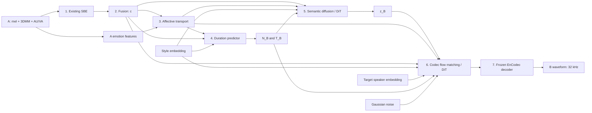

# Full LLM-free empathetic speech architecture / 전체 공감 음성 구조

For a step-by-step explanation with examples and dimension tables, read
[the beginner's model guide](MODEL_EXPLAINED_FOR_BEGINNERS.md).

All seven model stages are connected, with training, checkpoint resume, target
preparation, and waveform inference. The original delivered example uses synthetic
Person-A features, an untrained response generator, and a pretrained, frozen
EnCodec decoder. Its WAV checks execution, not speech quality. Server deployment
now includes two-GPU training and a successful one-epoch real-data smoke test.
The full five-epoch job has been launched; its live status, rather than this static
document, determines whether it has finished. See [server instructions](README_server_training.md).

**현재 예시는 합성 입력과 미학습 생성기를 사용합니다. 실제 공감 음성 품질은 검증하지 않았습니다.**

## Implemented flow



| Stage | Implementation |
|---|---|
| 1–2 | Original SBE and Fusion MLP, with the existing masks and valid-prefix alignment |
| 3 | Previously added temporal affect Transformer; six normalized channels |
| 4 | Masked mean pooling of context and affect, plus style; MLP predicts log-duration |
| 5 | Non-autoregressive continuous semantic-token diffusion with cosine noise schedule and DDIM sampling |
| 6 | Conditional rectified-flow Transformer with midpoint ODE sampling |
| 7 | Real pretrained EnCodec 32 kHz decoder, held in evaluation mode with gradients disabled |

The DiT blocks use adaptive LayerNorm, self-attention, context cross-attention,
and feed-forward layers. Both diffusion time and response length are explicit
conditions. The semantic planner receives context, affect, style and its token
count. Codec generation receives semantics, affect, style, speaker, context and
its frame count. Padding is masked in attention, alignment, pooling and losses.
No LLM or text-generation service is used.

The implementation chooses the diagram's **DiT** semantic-planner option with
continuous embeddings. It does not implement a discrete vocabulary or text-token
mask-and-reveal model. Codec supervision uses MSE on flow velocity toward
quantized codec embeddings; adversarial and extra VQ losses are not enabled.

## Dimensions, time and compatibility

| Quantity | Default |
|---|---|
| Person-A mel | 80 dimensions; existing baseline mel rate 22050/256 Hz |
| Person-A 3DMM | 486 dimensions, preserving the supplied repo |
| Person-A AU/VA | 25 dimensions at 25 Hz |
| Context | 512 dimensions at 25 Hz |
| Affect | 6 dimensions on the context grid |
| Semantic tokens | 256-dimensional continuous speech embeddings at 12.5 Hz |
| Codec latents | 128 dimensions at 50 Hz |
| Audio output | Mono, 32,000 Hz |
| Styles | Six, using the original dataset's order |
| Target speakers | Integer identities 0–31 by default; configure the count for your dataset |

Token/frame counts use `ceil(duration * rate)` so the entire response is covered.
The decoded waveform is trimmed to `round(duration * 32000)` samples. Predicted
durations are bounded between 0.2 and 20 seconds by default. Inference never reads
B's duration, waveform, affect annotations or semantic targets.

`configs/full_speech_diagram_inputs.json` switches the SBE input contract to the
diagram's 58D 3DMM and 100 Hz mel. This requires corresponding input features and
compatible weights; 486D coefficients cannot be silently reshaped into 58D.
The default preserves the supplied baseline. The SBE's recurrent/Transformer
branches are also preserved, rather than replaced with the diagram's simplified
linear boxes.

Inputs are **pre-extracted features**, as in the existing repository. Face detection,
3DMM/AU extraction from a raw MP4, and upstream mel extraction are not provided
by these model stages. The archive does not include the necessary face-model
assets. Clips must be synchronized; alignment retains the baseline's interpolation
of each valid prefix to a shared grid. This is offline, bidirectional processing,
not a streaming system.

## Run the delivered example

From the repository root, using the prepared CPU environment:

```powershell
.\.venv\Scripts\python.exe infer_full.py --demo --config configs/full_speech.json --device cpu --output outputs/full_example
```

This uses the full 31.7-million-parameter generator, all seven stages, 24 semantic
sampling steps and 32 codec flow steps. The two pretrained models are downloaded
on first use and then cached. Inference needs only EnCodec; HuBERT is used for
training-target preparation.

The saved example has:

- Context `[1,11,512]`; affect `[1,11,6]`.
- Predicted duration approximately **0.907594 seconds**.
- Semantic tokens `[1,12,256]`; codec latents `[1,46,128]`.
- **29,043 audio samples at 32 kHz**; finite outputs throughout.

Files:

- `outputs/full_example/response_000.wav`: untrained generated audio.
- `outputs/full_example/stages.npz`: every intermediate output and mask.
- `outputs/full_example/summary.json`: configuration, exact sampling steps and provenance.
- `outputs/full_preflight/preflight.json`: full-size forward/backward verification.

`configs/full_speech_small.json` runs the same architecture with fewer layers for
development. Plain `infer_full.py --demo` uses that smaller preset. Nothing is
trained by inference. WAV writing can attenuate peaks above 0.95 to avoid clipping;
the unmodified waveform remains in `stages.npz`.

## GPU environment

Use a separate Python 3.10+ environment on the training machine. Install a
CUDA-enabled PyTorch build suitable for that machine using the
[official PyTorch installation selector](https://pytorch.org/get-started/locally/),
then install the remaining requirements:

```bash
python -m pip install -r requirements/full_speech.txt
python -c "import torch; print(torch.__version__); print(torch.cuda.is_available())"
```

The second result must be `True` for the GPU command below. This workspace currently
has **CPU-only PyTorch**. Installing other dependencies does not convert that build
to CUDA. CUDA and mixed precision are implemented but have not been executed here.
Lower `--batch-size`, the layer counts, or the maximum clip duration if GPU memory
is insufficient; actual memory requirements depend on your hardware and data.

## Prepare real paired data

Use `examples/full_speech_source.example.json` as the source-manifest template.
Every row describes A's input features and B's response. Paths resolve relative
to the source JSON. The example paths are placeholders, not supplied real data.

| Field | Required contents |
|---|---|
| `conversation_id` | Stable ID shared by all styles/responses from the same conversation |
| `split` | `train`, `val` or `test`; conversations may not cross splits |
| `mel` | A's float `[T,80]` tensor in .pt or .npy |
| `dmm` | A's float `[T,486]` .npy, or the baseline's directory of per-frame 3DMM files |
| `au` | A's float `[T,25]` .npy |
| `response_audio` | B's real response WAV/FLAC; mono conversion and resampling are automatic |
| `affect` | B's normalized, annotated float `[T,6]` .npy trajectory |
| `style_id` | Integer style ID |
| `speaker_id` | Stable integer B identity across all splits |

Style IDs: 0 Affective Listening; 1 Cognitive Empathy; 2 Humor/Lighthearted;
3 Practical Advice; 4 Reflective/Mirroring; 5 Supportive/Encouraging.
Choose one persistent speaker-ID mapping and retain it when using checkpoints.
These are learned identity embeddings, not zero-shot voice cloning.

Affect channel order remains valence, arousal, pitch, energy, speaking rate,
dominance. Optional `affect_weight [T,6]` masks unknown labels with zero weight.
Valence is in [-1,1], others in [0,1]. These are normalized targets,
not physical units. **The baseline's emotion-class label alone does not supply
these six trajectories.** Provide measured/annotated targets and a consistent
normalization policy; the preparation code does not invent affect labels.

```bash
python prepare_full.py --source data/source_manifest.json --config configs/full_speech.json --output data/prepared --device cpu
```

Preparation runs two frozen pretrained models:

1. HuBERT produces speech representations from B's 16 kHz audio. A deterministic,
   fixed orthogonal projection reduces 768 to 256 dimensions, followed by temporal
   interpolation to 12.5 Hz. This projection is a design choice, not a learned
   semantic tokenizer or text vocabulary.
2. EnCodec encodes B's 32 kHz waveform. Its RVQ codebooks are decoded to the
   **quantized embeddings actually consumed by its neural audio decoder**.

Model revisions, dimensions, feature order and rates are recorded and checked.
Each prepared NPZ stores A's features, duration, style/speaker IDs, affect targets,
semantic targets and codec targets. Strict pretrained weight loading rejects
missing weights, including legacy HuBERT weight-normalization key mismatches.
The source audio itself is not uploaded to a service.

For a reproducible synthetic preparation check:

```bash
python prepare_full.py --synthetic --config configs/full_speech.json --output outputs/prepared_synthetic --device cpu
```

These five examples use random A features, simple B tones, artificial affect labels,
and real frozen target encoders. They are suitable only for software verification.
Training refuses such a cache unless `--allow-synthetic` is explicitly supplied.

Once CUDA is installed, a one-epoch GPU software check on the included examples is:

```bash
python train_full.py --manifest outputs/prepared_synthetic/manifest.json --config configs/full_speech.json --train-sbe-from-scratch --allow-synthetic --device cuda --amp --epochs 1 --output outputs/gpu_smoke
```

This command tests training execution; synthetic tones cannot train useful empathetic speech.

## GPU training command

After preparing real data and providing your existing **complete SBE checkpoint**:

```bash
python train_full.py --manifest data/prepared/manifest.json --config configs/full_speech.json --sbe-checkpoint checkpoints/sbe.pth --device cuda --amp --batch-size 4 --epochs 100 --output outputs/full_speech_training
```

This follows the diagram's frozen visual/emotion branches while allowing the
audio projection, fusion, affect, duration, semantic planner, codec generator and
style/speaker embeddings to learn. The codec and semantic teacher are frozen and
used only during target preparation, so their weights do not consume training
GPU memory.

The SBE checkpoint may be a standalone full SBE state dict or the `sbe.*` portion
of the original Stage-2 checkpoint. Partial legacy branch checkpoints are not
silently accepted. You can initialize module 3 with `--affect-checkpoint` when its
configuration matches.

**If you have no trained SBE checkpoint**, replace
`--sbe-checkpoint checkpoints/sbe.pth` with `--train-sbe-from-scratch`.
That explicitly trains the visual/emotion branches too, instead of freezing
random weights. It is a different initialization regime from the diagram.

The loss is the sum of four per-sample objectives:

- Affect MSE against B's normalized trajectory aligned to the context grid.
- Smooth L1 loss on log-duration.
- Semantic diffusion noise-prediction MSE.
- Codec flow-velocity MSE toward B's quantized codec latent targets.

Semantic and codec normalization statistics are fitted on **training data only**,
stored as model buffers, and reused in inference. Codec training uses GT semantic
embeddings; inference uses the planner's generated embeddings. Validation uses
fixed noise for consistent comparisons, not generated-speech quality metrics.
The script includes AMP, finite-value checks, gradient clipping, AdamW, LR
reduction, validation, JSONL metrics, and atomic best/last checkpoints.
`torchrun --nproc_per_node=2` enables DDP. Batch size is per GPU; validation
sharding does not duplicate samples. AMP defaults to BF16; use
`--amp-dtype float16` on GPUs without BF16 support. Resume requires the same
world size and restores each rank's RNG state.

Resume at an epoch boundary:

```bash
python train_full.py --manifest data/prepared/manifest.json --resume outputs/full_speech_training/last.pt --device cuda --amp --epochs 200 --output outputs/full_speech_training
```

Checkpoints restore model, optimizer, scheduler, scaler, statistics, freeze state,
epoch, step and RNG states. A changed manifest is rejected. CPU resume is tested
against an uninterrupted run. Reproducibility across different GPU hardware or
PyTorch versions is not guaranteed.

## Training preflight and inference after training

The delivered CPU preflight performs one forward and backward pass with
**zero optimizer updates**:

```bash
python train_full.py --manifest outputs/prepared_synthetic/manifest.json --config configs/full_speech.json --train-sbe-from-scratch --allow-synthetic --device cpu --check-only --output outputs/full_preflight
```

After real training, create an NPZ containing only A's `mel`, `dmm`, `au` and
the requested `style_id`/`speaker_id`. Features can be unbatched `[T,D]` or
batched `[B,T,D]`; padded batches must include `mel_len`, `dmm_len`, `au_len`.
For scalar style/speaker IDs, use one unbatched sample. No B targets are needed.

```bash
python infer_full.py --input person_a.npz --checkpoint outputs/full_speech_training/best.pt --device cuda --output outputs/generated_response
```

`infer_full.py` reads only the A features and explicit style/speaker conditions.
Even when a prepared NPZ also contains B's targets, those targets are ignored.

## Verification and files

Default unit tests run offline; enable pretrained integration tests when the model
weights are cached or downloading is acceptable:

```powershell
$env:BK_TEST_PRETRAINED = "1"
.\.venv\Scripts\python.exe -m unittest discover -s tests -v
```

Tests check conditioning paths, masks, target padding, output rates, finite
gradients in every new stage, explicit 58D/100 Hz input support, checkpoint
restoration, training resume, split leakage, real codec reconstruction, and the
frozen semantic teacher. Tiny optimizer steps occur only inside temporary
resume tests; they do not produce the delivered example or trained response weights.

Verification includes CPU architecture tests, real pretrained integration tests,
two-process resume equivalence, and full-size two-GPU finite-gradient checks.
Server logs record the actual test and training results.

| Location | Role |
|---|---|
| `model/full_speech/` | Config, DiT blocks, planners, complete system and frozen codec/teacher |
| `dataset/full_speech_dataset.py` | Prepared-cache validation, batching and train-only statistics |
| `prepare_full.py` | Real/synthetic paired target preparation |
| `train_full.py` | GPU-ready training, resume and CPU preflight |
| `infer_full.py` | Seven-stage inference and WAV export |
| `tests/test_full_speech.py` | Full architecture and pretrained integration tests |

The existing module-3 CLI and legacy mel inference/training entry points remain
available. New code comments and docstrings use short English and Korean text.
The downloadable ZIP includes source, synthetic prepared examples and verification
outputs, but excludes the virtual environment and external model weights.

Pretrained references: [EnCodec 32 kHz configuration](https://huggingface.co/facebook/encodec_32khz/blob/main/config.json),
[EnCodec implementation](https://github.com/huggingface/transformers/blob/v4.44.2/src/transformers/models/encodec/modeling_encodec.py),
[HuBERT documentation](https://huggingface.co/docs/transformers/en/model_doc/hubert).
