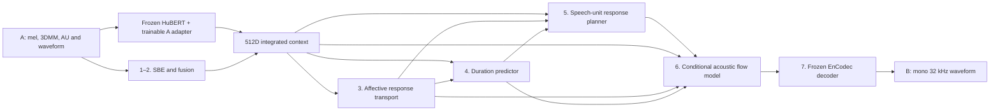

# BK Empathetic Speech

One consolidated source snapshot of the LLM-free empathetic speech-to-speech research system, current through **30 September 2026**. The code preserves the supplied speaker encoder and implements affect planning, response duration, speech-content planning, acoustic generation, and a frozen neural codec.

**Research status:** speech reconstruction improved, but reliable, appropriate responses to unseen Person-A inputs have not been demonstrated. The latest inspected response checkpoint is the experimental causal unit planner at conditional step 1,600. It was not promoted as a production model. Human listening ratings are pending.

Read [EXPERIMENT_HISTORY.md](EXPERIMENT_HISTORY.md) for the original architecture gaps, confirmed defects, corrections, all experiment stages, and remaining problems. This is a single code release, not separate first/second-version projects. Some internal architecture identifiers retain numeric suffixes because saved checkpoints depend on them.

## Included and excluded

- Included: current source, all seven stages, standard masked-unit and experimental causal planners, data preparation, training, inference/evaluation, diagnostics, tests, configuration examples, and original license notices.
- Excluded: datasets and real conversation manifests, trained checkpoints/codebooks, downloaded pretrained weights, generated audio/video, logs, virtual environments, SSH material, old status guides, cancelled deployment queues, and the original mel-only training/inference entry points.
- Existing upstream support modules remain where current imports and compatibility require them. There is only one copy of each included source file.
- The proposed response-selection/retrieval planner is **not implemented** in this snapshot. No new training was performed to create this release.

## Current architecture



Requested empathy style also conditions affect, duration, planning and acoustics; the voice-group embedding conditions acoustics. No text-generating LLM is used. HuBERT and the waveform content evaluator are pretrained speech models. Text transcripts supervise training/evaluation; they are not B inputs during ordinary inference.

Here `B` is batch size, `T_c` is the aligned A-context length, and `N_B` is the planned response length. Different timelines have different masks.

| Component / quantity | Input | Output / current contract |
|---|---|---|
| A mel | Pre-extracted features | `[B, T_mel, 80]`; baseline rate `22050/256` Hz |
| A appearance | Pre-extracted 3DMM | `[B, T_video, 486]` |
| A expression | Pre-extracted AU/VA | `[B, T_video, 25]` |
| SBE and fusion | Three feature branches | `[B, T_c, 512]`, approximately 25 Hz |
| A speech features | Normalized mono A audio at 16 kHz | HuBERT `[B, N_A, 768]`, aligned to 50 Hz; adapted to 512D context |
| Module 3 | A context, expression, requested style | `[B, T_c, 6]` target affect trajectory |
| Module 4 | Masked context/affect pools and style | `[B]` duration in seconds |
| Module 5 | A context, affect, style, planned length | Unit logits `[B, N_B, 1024]`; selected IDs `[B, N_B]` |
| Unit lookup | IDs and training-fitted codebook | `[B, N_B, 768]` acoustic conditioning |
| Module 6 | Unit features, context, affect, style, voice and noise | Codec latents `[B, T_B, 128]` at 50 Hz |
| Module 7 | Codec latents | `[B, samples]` at 32,000 Hz |

Current units run at **50 Hz**, not the diagram's illustrative 12.5 Hz. Actual input appearance width is **486**, not 58. Unit counts and codec counts use duration times their rates, rounded up; audio is trimmed to the requested sample count. The typical planner has width 256 and four blocks; acoustics use six blocks and 32 sampling steps. Checkpoint configuration is authoritative.

The six affect channels are valence, arousal, pitch, energy, speaking rate, and dominance. Only pitch, energy, and transcript-derived speaking rate have measured B targets in the available dataset. Valence/arousal/dominance do not have verified direct labels. At inference, Module 3 predicts from **A**, not from B's unavailable recording. Existing male/female voice groups do not establish actual speaker identities.

## Install and test

Use Python 3.10 or newer in a separate environment. The server experiments used Python 3.10, PyTorch 2.5.1 with CUDA 11.8, and Transformers 4.44.2. Four-GPU training was run on four RTX 3090 GPUs. Install an appropriate PyTorch build for your machine before the requirements below.

```bash
python -m venv .venv
source .venv/bin/activate
python -m pip install -r requirements.txt
python -m unittest discover -s tests -v
```

On Windows, activate with `.venv\Scripts\Activate.ps1`. The default test suite uses synthetic tensors and fake codec fixtures; expensive pretrained-model and distributed checks are opt-in. The exact checks performed on this package are in [RELEASE_CHECKS.md](RELEASE_CHECKS.md).

Minimal Module-3 execution needs only `requirements/affect.txt`. `requirements/upstream_optional.txt` records optional dependencies of inherited facial-reaction utilities; those are not required for the main speech path. Training and Linux-only experiment controllers should run on Linux. Pretrained model downloads require network access on first use; versions/revisions are recorded in model configuration.

## Dataset and preparation

The repository contains loaders, not the dataset. The BK adapter expects the original folder structure, including `generated_text/train_final_with_reference_images.json`, Person-A feature/audio files, and `generated_output_audio/` response WAVs. It resolves established filename aliases and checks missing files.

Conversations are split before expanding their six styled B responses. The observed corpus has 10,000 conversations and 60,000 response rows, split into 8,500/1,000/500 train/development/test conversations. Keep every response to one conversation in the same split. A face image is not an audio speaker identity label.

Preparation extracts frozen B HuBERT features, codec targets, duration and measured prosody. It also caches A speech features and A/B transcripts for supervised objectives. Normalization and codebook fitting use training data only. At generation time, the `person_a_only` whitelist excludes B targets.

For the original BK layout, the preparation sequence is:

```bash
python scripts/build_bk_source.py --dataset /path/to/bk-dataset --output outputs/bk_source
python prepare_full.py --source outputs/bk_source/source.json --config outputs/bk_source/config.json --output outputs/bk_prepared --device cuda:0
CUDA_VISIBLE_DEVICES=0,1,2,3 torchrun --standalone --nproc_per_node=4 prepare_quality.py --source outputs/bk_source/source.json --base-config outputs/bk_source/config.json --base-manifest outputs/bk_prepared/manifest.json --output outputs/bk_quality_prepared
```

These commands create training targets; they do not train a response model. `prepare_quality.py` is specific to the observed BK layout. `examples/full_speech_source.example.json` illustrates the lower-level paired source format with placeholder paths. Raw-video face/AU extraction is outside this repository's speech pipeline.

`configs/speech.json` is a current 768D/50Hz starter configuration. `configs/full_speech*.json` serve the original continuous scaffolding and smoke checks. They are not interchangeable with a trained unit checkpoint. Loading a checkpoint restores its own configuration and codebook.

## Training entry points

| Script | Purpose |
|---|---|
| `train_full.py` | Initial seven-stage continuous model and synthetic preflight |
| `train_quality.py` | Content-supervised continuous initialization |
| `scripts/fit_speech_units.py` | Fit a training-only codebook |
| `scripts/initialize_unit_interface.py` | Convert a compatible acoustic checkpoint to the unit interface after its measured gate |
| `train_recovery.py` | Explicit acoustic, masked-unit prior, conditional-planner or joint research stages |
| `scripts/train_planner_ar.py` | Experimental causal prior/conditional adaptation and evaluation |

The current unit experiments require a compatible initialized checkpoint, a prepared manifest, and a hashed selection JSON. Those private artifacts are excluded from this source ZIP. They cannot be replaced with unrelated public weights. Creating equivalent initializers from scratch requires the preceding training stages; the repository does not claim a one-command route to the historical quality results.

For example, the latest causal conditional experiment's **training recipe** uses four GPUs and batch 16 **per GPU** (global batch 64):

```bash
CUDA_VISIBLE_DEVICES=0,1,2,3 torchrun --standalone --nproc_per_node=4 scripts/train_planner_ar.py --phase conditional --initialize checkpoints/ar_prior.pt --manifest outputs/bk_quality_prepared/manifest.json --selection selections/paired.json --output outputs/ar_conditional --steps 1600 --batch-size 16 --lr 0.0003 --evaluate-every 400 --conditional-cache inputs_units
```

Paths are placeholders for compatible artifacts. With the recorded 2,048 selected training conversations, 32 updates equal one epoch, so 1,600 updates equal 50 passes. This command reproduces a research recipe; it is not a recommendation to restart it or evidence of validated response quality. `--resume outputs/ar_conditional/last.pt` replaces `--initialize` for an interrupted run with the same settings. Use a new output directory for a new experiment.

## Generate and evaluate

For a standard masked-unit checkpoint, real A-only inference is:

```bash
python infer_quality.py --checkpoint checkpoints/response.pt --features examples/person_a.npz --audio examples/person_a.wav --style 0 --speaker 1 --device cuda:0 --output outputs/example
```

Provide your own A files; they are not bundled. The feature NPZ uses `mel`, `dmm`, and `au`. This entry point intentionally rejects the experimental causal checkpoint type. The causal branch has its own explicit evaluator:

```bash
python scripts/train_planner_ar.py --phase evaluate --checkpoint checkpoints/ar_conditional.pt --manifest outputs/bk_quality_prepared/manifest.json --selection selections/development.json --audio-selection selections/audio_eight.json --sampling categorical --temperature 0.8 --top-k 20 --sampling-seed 42 --seed 42 --device cuda:0 --output outputs/ar_evaluation
```

The audio selection must contain exactly eight development records, all included in the larger development selection, plus the consistent training selection required by the selection validator. Selection files include the manifest hash and `train`/`val` record paths. This evaluator also reads B targets for scoring; its ordinary generated waveform receives only A and requested style/voice. Reference/oracle audio is labeled separately.

For a quick Module-3 synthetic demo without speech model downloads:

```bash
python infer_affect.py --help
python infer_affect.py --demo --device cpu --output outputs/affect_demo
```

The demo uses untrained weights and verifies execution only. More diagnostics in `scripts/` check target integrity, A information, shuffled conditioning, duration, affect, sampler behavior, frozen gradients and blinded listening. Historical `run_*` experiment controllers expect their original private artifacts and explicit review decisions; they are retained for reproducibility and are not the default public startup commands.

## Interpretation and attribution

Lower training loss, a valid waveform, or a good reconstruction from true B units does not establish an appropriate free response. Report intelligibility, relevance, emotional appropriateness and naturalness separately. Reference WER can exceed 100% and can penalize valid alternative responses. Do not present automated ASR as a human listening score.

The original PerFRDiff-derived SBE, fusion, recurrent and appearance modules are retained with their existing author/license notices. See [LICENSE](LICENSE) and [THIRD_PARTY_NOTICES.md](THIRD_PARTY_NOTICES.md). Short Korean/English comments in the added implementation are preserved. `RELEASE_MANIFEST.json` records file hashes for this exact source snapshot.
